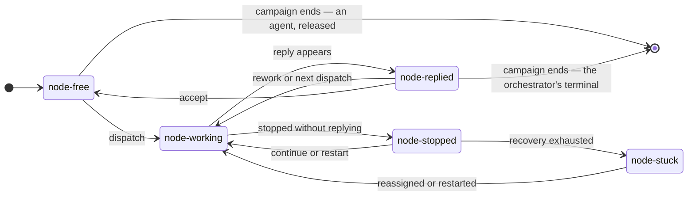

# Dispatch protocol

A protocol for one dispatcher supervising one worker, applied at every level of a **campaign**:
one orchestrated unit of work, run by a team of agents against one mission. It deliberately
excludes verb sets, file formats and implementation. Those follow from this, and none of them
should shape it.

---

## 1. Roles

Two roles, and one participant holds both.

| Participant | Dispatcher | Worker |
|---|---|---|
| host / operator | ✔ dispatch and reply only (see below) | |
| orchestrator | ✔ (to each agent) | ✔ (to the host) |
| agent | | ✔ |

Everything below describes **one dispatcher–worker pair**. The host/operator follows the
dispatch-and-reply part of it with the orchestrator: it opens a dispatch, and the
orchestrator's reply closes it. Acceptance and the recovery ladder are the orchestrator's
alone.

This still matters: rules written only for agents would leave the orchestrator with no
defined obligations at all. It is a node here: it has states, and it owes a reply. What it
does not have is a dispatcher that judges for it, and that is deliberate. The host carries it on
mechanically after a provider refusal (§9). Recovering a stopped
orchestrator is the operator's, by design (§9).

## 2. Three nouns

| | What it is | Owner |
|---|---|---|
| **turn** | one invocation of a model: it runs, produces output, stops | the CLI |
| **dispatch** | a unit of work a dispatcher asked for, named by an ID | the dispatcher |
| **reply** | a durable artifact stating that a dispatch is concluded | the worker |

A dispatch causes exactly one turn, so they are 1:1 in count. They are **not** the same
question:

- *turn ended*: the model stopped talking. This is mechanical, and always detectable.
- *dispatch answered*: the model considers the work concluded. This is semantic, and **only the
  worker knows it**.

The two are independent in both directions. A turn can end cleanly with the work unfinished, when
a worker stops believing it is waiting for something. A turn can end badly while the work is
progressing perfectly well, when a watchdog gives up on a worker that was merely quiet. Neither
ending tells you anything reliable about the dispatch, which is the entire reason a reply must
exist as a separate thing.

**"Turn" is internal vocabulary.** A worker is never asked to reason about turns. It is told:
*if you stop, everything stops, so do not stop until you have replied.* The harness and the
operator use the word; workers do not need it.

**A reply is an artifact, not a message.** It is written where a reader can check for its
existence without interpreting anything. That makes "did it come back?" a single cheap question
(§6) rather than a per-CLI parsing problem, and it lets the answer survive a worker whose session
was cleared.

## 3. One rule

> **A dispatch is open until its reply appears. Anything sent while it is open continues it.
> The first thing sent after it closes opens a new one.**

The reply draws every line, so a dispatcher never has to classify its own messages. There are
no message kinds, no supersede or replace semantics, and no separate "resume" concept:

- **Rework** is a new dispatch, because the previous one was closed by its reply.
- **Nudging a worker that stopped** is a continuation, because its dispatch is still open.
- **Restarting a worker that lost its memory** is a continuation that happens to carry more
  context, because the worker no longer knows what it already did.

**At most one dispatch is open per node.** A second cannot be opened while the first is open,
because anything sent then is a continuation. So "the current dispatch" is singular, and every
reply belongs to exactly one dispatch without needing to say which.

## 4. The mission is a dispatch

The host's dispatch to the orchestrator is the **mission itself**. One dispatch, held open
for the campaign's whole duration.

It follows that **the campaign's verdict is that dispatch's reply.** There is no separate
summary mechanism, no special file and no second vocabulary. When the orchestrator answers the
one thing it was asked, that answer is the outcome of the run.

One thing is asymmetric, and only one. The product constrains the **content** of that reply,
because it has to be comparable across campaigns in a way an agent's "I built the auth layer"
does not. Every mission reply carries exactly one outcome:

All four answer one question, **why are you stopping?**, and exactly one applies:

| Outcome | Stopping because… | What the operator does next |
|---|---|---|
| `campaign-met` | the mission's stated criteria are all satisfied | nothing; this one does not need you |
| `campaign-converged` | criteria remain unsatisfied, and more effort from this team would not close them | decide whether the gaps are acceptable |
| `campaign-exhausted` | budget or wall-clock ran out while progress was still being made | resume or extend |
| `campaign-blocked` | effort was never the problem: an obstacle no iteration resolves, including a mission that cannot be satisfied as written | remove the obstacle |

**The test is mechanical: if you can name something unmet, it is not `campaign-met`.** All
three others must name what remains unmet. The list is the payload, and the label only
summarises it.

"Unmet" means **unmet against the mission as stated**, never against some absolute standard.
A mission with acceptance criteria can be met while the work remains imperfect in a hundred
ways nobody asked about. A mission with no criteria can never be met, because there is no bar
to clear. A campaign that never reports `campaign-met` is evidence about how missions are
being written.

The remaining three divide on *was effort ever the problem?* The answer is no for `campaign-blocked`, yes
for the other two, which then divide on whether more of it would have helped.

**An orchestrator that has established the mission is unreachable replies immediately**, rather
than spending the rest of its budget on work it has concluded cannot be delivered. A lost
machine is the defined case: no iteration resolves it, so the outcome is `campaign-blocked`,
naming what was lost. *Established*, not *expected*: difficulty is not an obstacle.

The `campaign-` prefix marks the scope: these describe the **campaign**, not a node, and the
two vocabularies must never be read as one. A node being `node-stopped` and a campaign being
`campaign-blocked` are unrelated facts at different altitudes.

The structure is otherwise identical to any other reply. Only the vocabulary is fixed.

**A campaign therefore needs no lifecycle of its own.** It is running for exactly as long as
the orchestrator's dispatch is open. It ends when that dispatch is replied to, and the reply's
outcome is its terminal state. There is no separate campaign state machine to keep in step with
anything.

**Consequence for §5:** the orchestrator occupies `node-working` for essentially the entire
campaign, and its single transition to `node-replied` *is* the campaign ending. Agents cycle
through the states many times. The state machine is the same and only the residency differs, which is a property of the work,
not of the protocol.

## 5. Node states

Five, describing **one node with respect to one open dispatch**. They are computed on
demand, never stored (§6).

| State | True when | Dispatcher's move |
|---|---|---|
| `node-free` | no open dispatch | assign work |
| `node-working` | dispatch open, node active | nothing; leave it alone |
| `node-stopped` | dispatch open, node inactive, no reply | continue it |
| `node-replied` | a reply exists for the open dispatch | read it; the dispatch is closed and the dispatcher owes a response |
| `node-stuck` | the orchestrator has exhausted its recovery instruments | none; the node is unrecoverable and every item assigned to it is unreachable |

Two prefixes, two altitudes: `node-` describes a participant, `campaign-` describes the run.
`dispatcher` and `worker` are deliberately *not* prefixes. They name a relationship, not a
thing, and one participant holds both at once.

**Nothing at this level requires judgment.** Every move is either mechanical, determined entirely
by the state, or parameterised by a threshold the operator sets. Those thresholds are how many
recovery attempts to spend, how long before the elapsed bound trips, and how many failed probes
call a machine gone. An implementation is therefore configured per campaign, never re-decided per
campaign.

Judgment enters this protocol in exactly one place: an orchestrator deciding whether to
accept an agent's reply or send it back as rework. Everything else at node level is
mechanical, or a number the operator set. Only acceptance is recorded (§7), which is why §6
must read it, because it is the only input to a node's state that does not come from the node itself.

### Recovering a node

A dispatcher has two instruments, ordered by cost:

| | Cost | Recovers |
|---|---|---|
| **continue** | cheap; the node keeps its context | a node that merely stopped |
| **restart** | the node loses its context and re-anchors from its brief | a wedged session |

**The ladder replaces diagnosis, where diagnosis is impossible.** `node-stopped` is ambiguous
between a node that stopped and a session that wedged, and those are not distinguishable by
observation. A dispatcher does not identify the cause: it applies the cheaper remedy, then the
dearer one, and learns which failure it had from whichever worked.

**A cause that can be looked up is not diagnosed either. It is read.** A node's machine records
how each of its turns ended (§6). When that record says the node's provider ended the turn, the
ladder is the wrong answer. Both of its instruments send the node's context again, and that is
the load the provider refused. Three endings are read and not laddered:

| The turn ended because | What it costs | Why |
|---|---|---|
| the provider throttled the node, was overloaded or down, or could not be reached | a wait, then the same session carries on; no rung | the node did nothing wrong, and retrying is the load |
| the provider rejected the node's credential | nothing is sent; the node is `node-stuck` at the first look | no instrument of a dispatcher's repairs a credential (§9) |
| the node's context is too long for its model | the restart, first | a continue sends the same context again, and only a restart shortens it |

Every other ending, and every ending the node's machine cannot explain, gets the ladder as
before. **A reason older than the newest message is never used**: it describes an attempt that
has been superseded, and must not be held against the next one.

**A rung is a turn.** A continue or a restart whose message arrived and whose turn never ran has
spent nothing, and the dispatch is carried on without charge. Launching a turn crosses the
network and starts a program, so it fails under exactly the conditions recovery exists for. A
ladder that counted messages could be spent by a bad connection, against a node that was never
given a turn.

**The budget is bounded by both attempts and elapsed time, whichever trips first.** The
elapsed bound runs from the moment the dispatch opened; a continuation does not reset it.
Neither alone suffices. An attempt count lets a node that works a while and then stops each time bleed for
hours. A clock lets a node that stops instantly spin uselessly for the whole window.
The values are policy, the operator's, per campaign. Exhausting the ladder produces
`node-stuck`.

**A stuck node blocks its whole queue.** Its dispatch never closes, and a node holds at most
one open dispatch (§3), so it can never be dispatched to again. Every item assigned to it is
unreachable, not only the one in flight. A dispatcher that writes off just the in-flight item
will wait out its whole clock on work that can never be delivered.

**There is no human in this loop.** The orchestrator decides what happens to a stuck node's
work. A human is the backstop for the orchestrator (§9), and learns of an agent failure
through the mission reply.

```
  FROM            ON                        TO
  ─────────────────────────────────────────────────────
  ●               start                     node-free
  node-free       dispatch              →   node-working
  node-working    reply appears         →   node-replied
  node-working    stopped without reply →   node-stopped
  node-stopped    continue or restart   →   node-working
  node-stopped    recovery exhausted    →   node-stuck
  node-stuck      reassigned/restarted  →   node-working
  node-replied    rework or next        →   node-working
  node-replied    accept                →   node-free
  node-free       campaign ends         →   ◉   (an agent, released)
  node-replied    campaign ends         →   ◉   (the orchestrator's own terminal)

  every state has ≥1 way in and ≥1 way out
```



**`node-refused` is deliberately not a state either.** It is the second overlay. While a node's
provider is refusing its turns, the dispatcher has learned something about the node's
surroundings and nothing about the node. A failed probe is a fact about the observation in just
the same way. The move is to wait for at least as long as the provider asked, for longer
each time it refuses again, and then to carry the same session on. Nodes refused together are
not brought back together, because their combined return is what was refused. The wait is
computed from the node's own record of its turns, never kept by the dispatcher. It is bounded by
an operator's number, and the elapsed bound runs throughout, so a provider that never relents
ends in `node-stuck` with the refusal named.

**`node-unreachable` is deliberately not a state.** When a probe fails, the observer has learned
nothing, which is a fact about the observation rather than about the node. Drawing it as a state
invites treating "I cannot see it" as "it is idle," which is the direction that gets live
work destroyed. It overlays every state and resolves when the probe next succeeds.

**Sustained unreachability is a conclusion: the machine is gone.** One failed probe carries no
information; a run of them does. **A look in which no node answered is a fact about the
observer.** Its own network failed, or its own machine was too slow, and no node moves toward
the conclusion on such a look. The same holds for a probe that ran out of time, which is what a
machine under load produces. How long a node has gone unseen is the one thing an observer may
remember between looks. Its subject is a machine that does not answer, so it cannot be looked
up. A wait is also chunked (§8) into calls far shorter than a lost machine stays lost. It is the
observer's knowledge about its own looking, never node state, and losing it costs only time. No recovery instrument reaches a machine that cannot be
reached at all, so this is the §9 boundary rather than another rung of the ladder. The
threshold is policy, like the recovery budget, making these the only two node-level policy
inputs that rest on an operator's number rather than on observation alone.

**A campaign has two terminals.** An agent ends released, with no open dispatch. The
orchestrator ends at `node-replied`: it never reaches `node-free`, because its reply *is* the
campaign ending (§4).

**Two kinds of arrow, and the difference matters:**

- **world events**: `reply appears`, `node stopped`. These become true on their own.
- **dispatcher actions**: `dispatch`, `continue`, `accept`. Someone performs them.

## 6. Node state is computed

**A dispatcher computes a node's state on demand, from that node's own machine. It is never
stored.** Look, act, discard, the way you run `ps`.

| To answer | Read |
|---|---|
| what was it asked, and when? | the dispatch in its input channel |
| did it come back? | whether its reply exists |
| is it alive, and for how long? | its process table, and the agent's own word on whether it is in a turn |
| how did its last turn end? | the node's own record of its turns |
| has the orchestrator accepted its reply? | **the orchestrator's acceptance record** (§7) |

All but the last live inside the node's own machine. A node cannot reach out, so nothing it
produces ever travels on its own. Computing a state means: connect, ask, done. One round trip.

**Acceptance is the single exception.** Every other transition leaves physical evidence: a
dispatch appears, a reply appears, a process vanishes. `accept` leaves nothing, because it is
not an action on the node. It is the orchestrator judging the work good enough, and afterwards
the node's machine is byte-identical to before. So `node-free` and `node-replied`
are indistinguishable there, and only the orchestrator's acceptance record settles it. **That
is the only place node state depends on anything outside the node.**

**Acceptance is the orchestrator's alone.** The host never accepts: its single dispatch is the
mission, and when the orchestrator replies the campaign is over. There is no next assignment
to free it up for. So the `accept` arrow is taken only on the orchestrator→agent leg, and the
orchestrator's own machine ends at `node-replied`.

**A dispatcher computes every node's state before acting on any of them.** Recomputing one
node at a time while acting makes it react to states its own actions produced, and states that
existed only between those actions are never observed at all.

**A poll may miss a transition entirely**, and nothing depends on catching them. A node that
stopped and resumed between two looks was never seen to stop. A record that *accumulated*
state would be wrong from then on. Recomputing returns the right answer at the next look.

Why this rather than a maintained record:

- **Nothing can go stale**, because nothing is stored.
- **Two observers never disagree about facts**: same computation, same ground truth.
- **A dispatcher that loses its memory recovers by looking.** Sessions die; this is the
  property worth protecting.
- **No transition has to be caught** for the current answer to be correct.

The test for anything anyone later proposes to record: **why can't you just look?**

## 7. What the orchestrator records

Only campaign judgment, the class of thing that exists nowhere but in its own head:

| | |
|---|---|
| **plan** | work not yet dispatched, and its ordering |
| **acceptances** | which dispatches it has judged sufficient |
| **assessment** | how the mission is going, what is unmet, what is at risk |
| **reported** | which stuck nodes its `wait` has already told it about |

> **Node state is derived and never recorded. Campaign state is recorded and never derived.**

**A judgment ends a wait once.** `node-stuck` never clears, and nothing on the node's machine
records that the orchestrator was told. Without the `reported` entry every later wait would
return at once, and the orchestrator could never block again (§8). The entry is written by the
wait itself when it returns the judgment. It belongs in the log for the reason everything else
does: an orchestrator that lost its memory reads there what it already knows.

It records nothing else about liveness or dispatch state. The branch is the work itself, and it is
what the orchestrator reads *before* an acceptance: input to the judgment, never part of node
state.

### Append-only

The orchestrator **only ever appends**. Append rather than rewrite because the writer
is a model: a careless append is still additive, a careless rewrite is destructive.

```
plan         auth first — it blocks both api and ui
accepted     dispatch-A                                    # auth
assessment   auth landed clean; api and ui can run in parallel now
plan         api and ui in parallel — auth no longer blocking
accepted     dispatch-B                                    # api
assessment   ui is larger than estimated; may not fit the budget
plan         ui only, polish pass dropped
```

Entries are chronological and never rewritten, so a later entry of a kind supersedes an
earlier one. How the log is *read* is the reader's choice rather than the protocol's: as current
state, as a timeline, or filtered by kind.

### Rules

- **Re-planning is another `plan` entry.** The *reason* for the change goes in an assessment;
  chronology pairs them.
- **The log is the mid-run channel; the reply is terminal.** Anything the operator should know
  before the campaign ends goes in an assessment as it is learned. A lost machine goes in
  immediately: the operator is the only party who can repair one (§9), so holding it until the
  reply spends their only chance to act.
- **At most one assessment per wake–act cycle, and only when something changed.** Never on a
  schedule. Freshness signals nothing about liveness, which §6 computes, so quiet periods stay
  quiet.
- **The plan holds undispatched work only.** Not a copy of the mission, and not per-task
  acceptance criteria, which belong in the dispatch itself, where the node can read them.

### Where it lives

The orchestrator's **own output channel**, alongside where its final reply will go. Forced
rather than chosen: it has no route out, so the only place it can write that the host can read
is its own machine.

It is a **claim**, never merged with derived node state (§9), and no more durable than the
machine holding it.

### Recovering after memory loss

Read the log, compute the node states (§6). Together those reconstruct everything the
orchestrator knew, with nothing depending on it having remembered to save state for that
purpose.

## 8. How the orchestrator stays alive

A model is not a process: it runs when invoked and then ceases. It cannot be woken, so a
background watcher inside its machine would have nowhere to deliver what it saw.

So the orchestrator is never notified. **It stays awake**, and something below it watches on
its behalf:

```
model (one long turn)
  └─ calls a blocking wait
       └─ subprocess polls the nodes every N seconds — no tokens spent
            └─ something actionable? → return to the model
model acts, calls wait again
```

Polling is unavoidable. This puts it **where tokens are not spent**: a model running the loop
itself pays a full model turn for every "nothing to do" check.

In practice the wait is chunked rather than one long block, since agent CLIs bound how long a
single tool call may run. The win is one model wake-up per interval instead of one per poll.

**The orchestrator calls the wait in the foreground**, as a call inside its turn. Some agent CLIs
can run a command as a background task and start a fresh turn when it finishes. An orchestrator
that waits that way works in turns the host did not start, so a provider error in one of
them is recorded nowhere. Its wait still wakes it within one chunk. An orchestrator that is idle,
with no turn running and its own session record still for longer than a chunk and a margin, was
never woken, and is `node-stuck`.

**An orchestrator that stops while its workers are still going is a defect in the
orchestrator**, not a condition for the host to paper over. The host's job is to make that
defect visible, not to repair it. An orchestrator whose provider refused its turn has not
stopped in that sense: it is waiting, and the host carries it on (§9).

## 9. How the host observes

Two reads. **Never a dispatch to the orchestrator**, because asking "how is it going?" costs a turn,
interrupts the work, and fails precisely when the orchestrator is stuck.

1. **Compute the node states itself**, over every node: the agents *and* the
   orchestrator. The orchestrator cannot observe its own death, so the host is the only party
   that can see it has stopped.
2. **Read what the orchestrator recorded**: plan, acceptances, running assessment.

**Shown side by side, never merged.** One is derived fact, the other is the orchestrator's
claim. "Orchestrator says backend is working" beside "backend is unreachable" is the
highest-value line an operator can see, and a single merged status column destroys it.

**During a campaign, the host observes, and acts only mechanically, for the one node that has no
dispatcher.** Every repair that takes judgment belongs to the orchestrator, and a campaign that
needs the host's judgment to keep it running has an orchestrator defect (§8). The orchestrator is
a node too, and its provider can refuse its turn as it refuses any agent's. Nothing above it
inside the campaign can carry it on. So the host performs for the orchestrator exactly what the
orchestrator performs for a refused agent. After the provider's wait, it resumes the same session
into the same dispatch, which spends no rung. The host derives that move the way it derives every
state, and performs no other. A continue, a restart and the verdict remain a person's. The boundary
sits at the machines themselves: a node whose machine is gone
cannot be restarted by an orchestrator, which has no power to create or boot one. A credential
the provider rejects is on the same side of that boundary, because an orchestrator cannot issue
or renew one. Both repairs are infrastructure work by a human, outside this protocol rather
than an exception within it. Both go into an assessment at once (§7), and both end a campaign
that cannot go on without the node as `campaign-blocked`.

## 10. Left to the implementation

Deliberately unspecified, because the protocol does not depend on the answers:

- **The values of the continue budget**: how many attempts, over how long. Policy, and it
  will differ by campaign and by node.
- **How a node is observed to be active.** §6 says the state is computed from the node's own
  machine; which signal proves liveness is a property of the runtime, not of the protocol. A
  process that wraps a turn cannot see a turn the agent started by itself, so the runtime should
  also be able to ask the agent.
- **How long to wait on a refusal, and how the return of a refused fleet is spread.** Only the
  properties are fixed: at least what the provider asked, longer on each repeat, not together,
  and bounded.
- **How the log and the reply are represented on disk.** Any format works that lets a reader
  check for a reply's existence cheaply and append to the log without rewriting it.

### Silent work must not read as stopped

This changes no states. It is a warning about how one distinction gets *made*.

`node-working` and `node-stopped` differ by whether the node is active (§5), and §6 computes
that from its process table. That is the right measure for silent work, because the process is
there whether or not anything is being emitted. **Every node does silent work.** An agent inside
a long build and an orchestrator inside a long wait (§8) are the same shape: a live process,
producing nothing.

The hazard is a second, independent observer. A node's own runtime may judge it idle from
output alone and **terminate it**, before any dispatcher's observation matters. Establish two
things per CLI family before relying on it:

- **silent work is not judged idle** by whatever detection the runtime applies
- **the maximum duration of a single call**, which sets how finely a wait must be chunked

If the first does not hold, raise the runtime's idle threshold rather than disabling it. Raise it
furthest for the orchestrator, because long quiet is normal for a supervisor and suspicious for
everyone else. The costs are not symmetric: a misjudged agent receives a `continue` on top
of live work, while a misjudged orchestrator stalls the campaign until a human notices.
